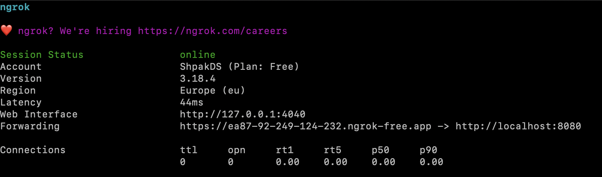
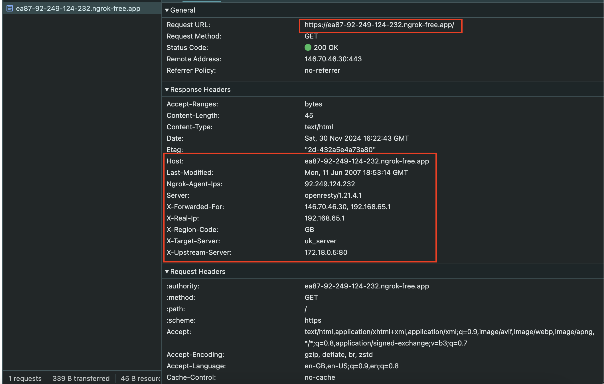

# HW14_Balancing
HW14_Balancing

## Setup
1. `docker compose up`
2. set ngrok and open tunnel - `ngrok http 8080`
3. turn on touch vpn (GB or US)
4. send a request to load balancer switching region - `curl ${ngrok-address}`
5. Open link forwarding link in browser.
6. Stop test server `docker stop uk_server`
7. 
## Results
1) Ngrok run

2) When using a VPN with a UK address, we see that uk_server is used
   

3) If you run the command `docker stop uk_server`, then all requests will be directed to `backup_server`